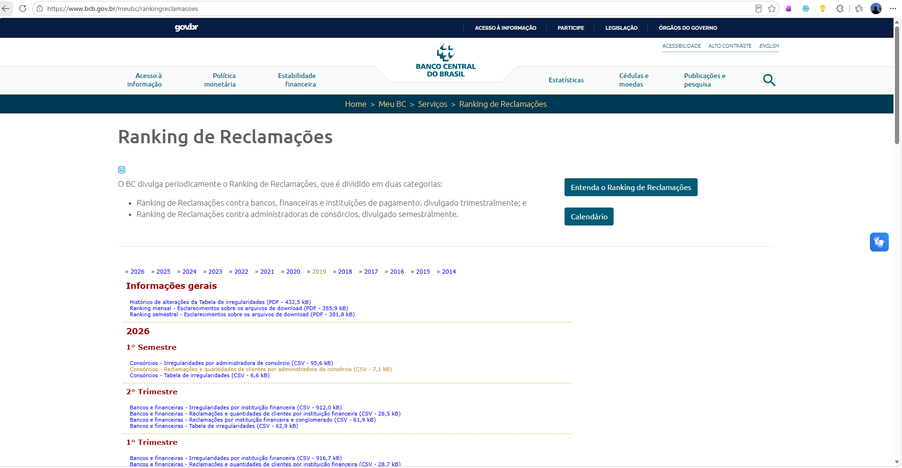
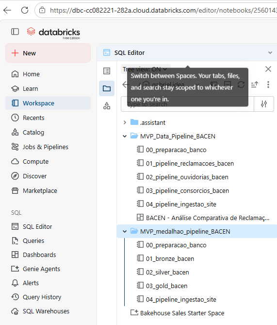
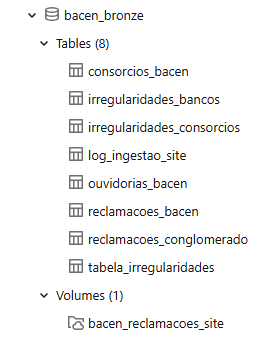
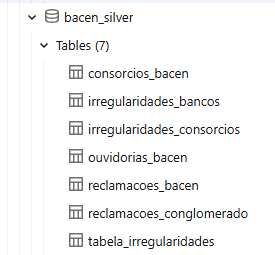
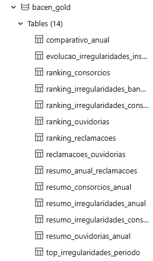
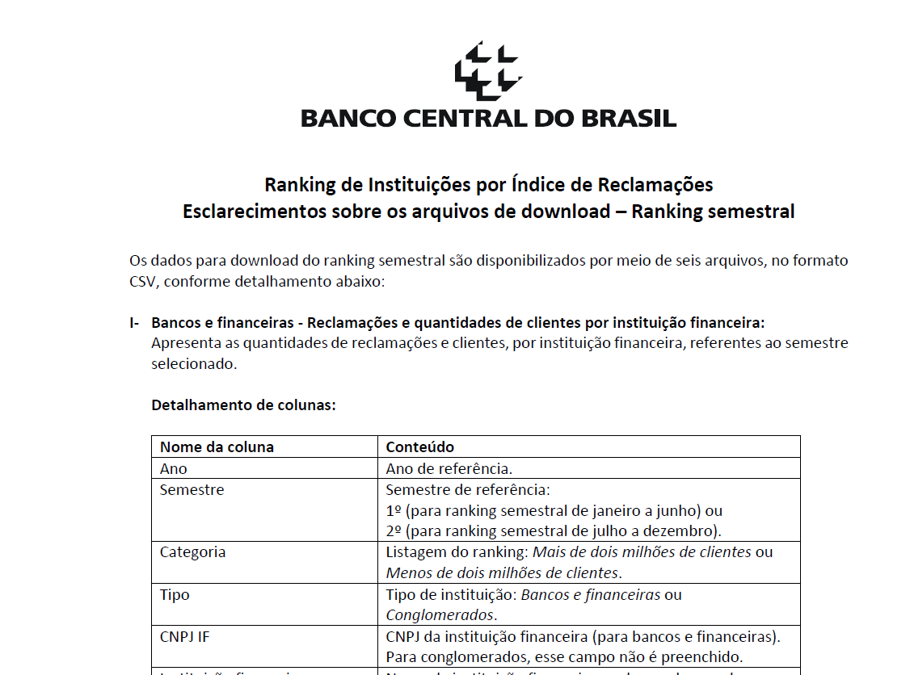
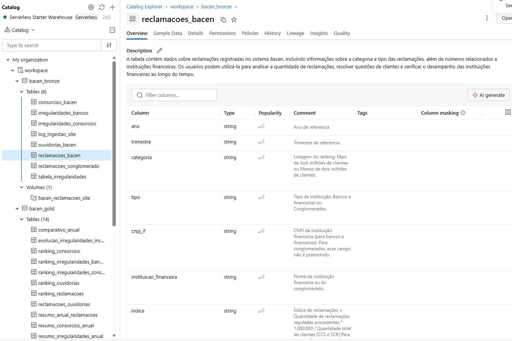
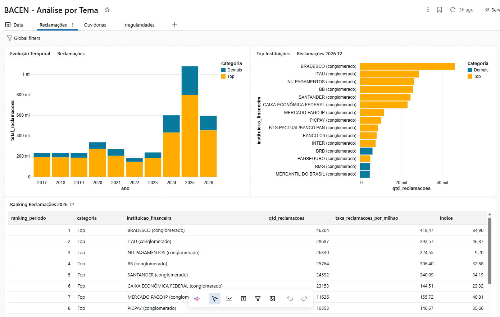
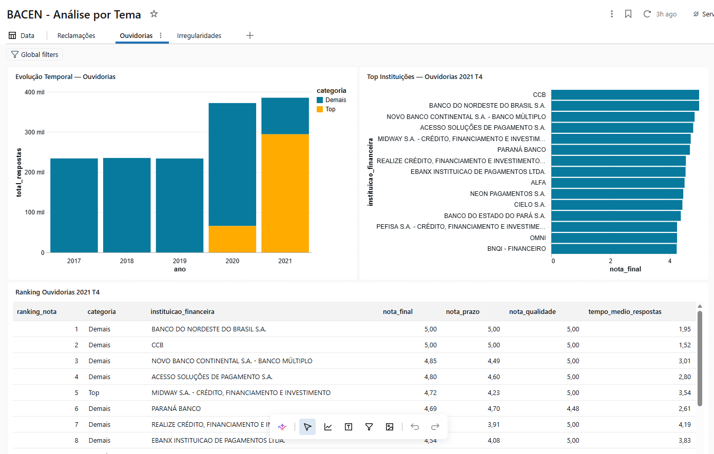
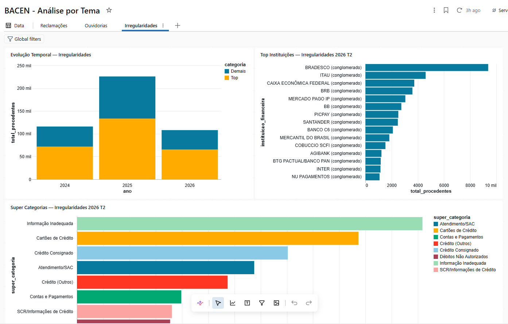

# MVP PUC Eng. de Dados: Pipiline de extração de dados de reclamação do BACEN - via API e via Manual

**Aluno**: Gabriel Pinto de Lira do Nascimento
**Matricula**: 4052026000244

**MVP - Setembro de 2026**


## 1. Considerões iniciais de motivação
Estou na minha segunda sprint da Pós de Machine Learning e Analytics. Na primeira de machine learning fiz sobre café: contexto é fundamental, e é um tema que tenho mais intimidade por ser um grande apreciado. 

Essa estratégia se tornou fundamental para construir um MVP que gerou valor para mim em questão de entendimento, e foi bem avaliado pela banca, justamente por ter contexto para criar uma analise critica do que fiz. Eu consegui parametrizar e criar uma narrativa critica das minhas decisões. E vou continuar com essa estratégia neste MVP. 

**Para este MVP resolvi construir um projeto de engenharia de dados que analisa os dados de reclamação do Banco Central do Brasil (BACEN).**

Atualmente sou analista de dados, e trabalho em uma instituição financeira, e o tema me pareceu instigante e curioso. Além disso o BACEN é uma fonte fartamente contextualizada por documentos gerados pelo próprio banco e que por isso considero confiáveis para poder trabalhar e extrair uma análise e para além de ter dados de qualidade, ter também os metadados e o contexto necessário para documentar e criar o catalogo de dados. 

Na minha jornada de transição de designer para analista de dados e quem sabe engenheiro considero a parte de contexto e documentação a mais carente de atenção nas empresas, mas que é muito importante. 


## 2. Objetivos

**Construir um pipeline de dados de ponta a ponta na nuvem para processar, estruturar e analisar o histórico de reclamações e a qualidade das ouvidorias dos bancos e consórcios no Brasil.**

Com base nesse ojetivo, consegui mapear que existiam dois caminhos para obter os dados: extração através de uma API, e manualmente, através de uma pagina do bacen, gerada dinamicamente, com tabelas em CSV e PDfs. 

Explorando os dados da API, percebi que não tinham todos os dados disponiveis, principalmente no que diz respeito as **irregularidades**. Isso é bem comum de acontecer: por mais que existam dados disponiveis em APIs, ainda assim é comum enriquecimentos feitos a partir de dados manuais, como arquivos CSVs e PDFs. 

Portanto tive de criar uma estrategia de extrair das duas maneiras: pela API e manualmente. 

E no final integrar os dados, criando uma **etapa de qualidade que verifica se os dados ja existem**, e completa apenas o que não foi carregado.


## 3. Análise e perguntas a serem feitas

O objetivo da análise é entender estrutrar e organizar os dados para poder extrair insights gerais relacionados a cada tema como:

Reclamações:
- Qual é o volume de reclamaçoes por ano? Quais são as instituiçoes mais cidatas? São dados recentes

Ouvidoria:
- Qual a avaliação é feita das instituições? Quais as mais citadas?

Irregularidades:
- Quais são as irregularidaeds mais cidadas? São muitas? É possivel agrupar e criar categorias?

Perguntas Gerais

- Todos os dados estão na API? Como vou ler os arquivos? Pelo nome ou pelo conteúdo? Como evitar duplicidade?

Embora o objetivo ideal da Engenharia de Dados seja automatizar fluxos de ponta a ponta, a própria natureza dos dados públicos governamentais e de relatórios regulatórios apresenta barreiras estruturais — como mudanças repentinas de layout por parte dos órgãos emissores, links dinâmicos sensíveis a sessões ou dados não estruturados que mudam de formato com o tempo.

Nesse cenário, fugir totalmente de etapas manuais e de checagens pontuais torna-se inviável. A proposta deste MVP, portanto, não é criar uma caixa preta 100% autônoma e inflexível, mas sim construir um pipeline híbrido e resiliente no Databricks. A arquitetura foi desenhada para automatizar a extração em massa de fontes estáveis (como APIs e endpoints estruturados do Banco Central do Brasil) ao mesmo tempo em que acomoda a ingestão orientada a volumes e arquivos históricos organizados manualmente, permitindo a governança, a validação de consistência e a auditoria de cada lote que entra no sistema.


## 4. Estratégia de Coleta e Fontes de Dados
Para garantir um pipeline resiliente e demonstrar diferentes capacidades de ingestão na camada Bronze, a etapa de extração foi dividida em duas abordagens técnicas complementares:

### 4.1: Ingestão Automatizada via APIs do Banco Central
A primeira parte do projeto foca na automação. Em vez de realizar downloads manuais, o pipeline utiliza scripts Python (PySpark e `requests`) para explorar e extrair dados dinamicamente direto das APIs oficiais:
* **Ranking de Reclamações (Bancos e Consórcios):** Exploramos o endpoint REST (`https://www3.bcb.gov.br/rdrweb/rest/ext/ranking/arquivo`) parametrizando as requisições em um loop iterando por ano e período.
* **Qualidade de Ouvidorias:** Consumimos a API Olinda OData (`https://olinda.bcb.gov.br/olinda/servico/RankingOuvidorias/versao/v1/odata/`), que permite acessar os relatórios formatados nativamente em JSON.

**Eu descobri a API através de pesquisas feitas no google**
Não achei trivial navegar em sites como: https://dadosabertos.bcb.gov.br/. A Inteligência artificial nesse aspecto foi um grande facilitador em achar e explorar a API. EM dados abertos não achei as informações. 

Então a IA apontou a existencia da API, e foi essa forma que descobri, para além do site manual. Alem disso ela me ajudou a testar

#### 4.1.1 Estrutura das APIs e Teste Rápido

Foram utilizadas duas APIs distintas do BACEN, com estruturas e padrões diferentes:

| API | Endpoint | Formato | Período coberto |
| --- | --- | --- | --- |
| Ranking de Reclamações (REST) | `https://www3.bcb.gov.br/rdrweb/rest/ext/ranking/arquivo` | CSV (download direto) | 2017–2026 |
| Ranking de Ouvidorias (Olinda OData) | `https://olinda.bcb.gov.br/olinda/servico/RankingOuvidorias/versao/v1/odata/` | JSON | 2017–2021 |

**API REST — Ranking de Reclamações:**

A API REST funciona como um endpoint de download direto de CSV. Recebe três parâmetros de query string: `ano` (ex: 2025), `periodo` (1–4 para trimestres) e `tipo` (tipo de instituição, ex: 'BANCO' ou 'CONSORCIO'). Retorna um arquivo CSV no body da resposta. Status 204 significa que não há dados para aquele período.

```python
import requests

# Teste rápido: Reclamações de Bancos — 2025 T2
url = "https://www3.bcb.gov.br/rdrweb/rest/ext/ranking/arquivo"
params = {"ano": 2025, "periodo": 2, "tipo": "BANCO"}
resp = requests.get(url, params=params)
print(f"Status: {resp.status_code}")  # 200 = OK, 204 = sem dados
print(f"Content-Type: {resp.headers.get('Content-Type')}")  # text/csv
print(f"Linhas: {len(resp.text.splitlines())}")  # ~80-120 linhas
print(resp.text[:200])  # primeiros caracteres do CSV
```

**API Olinda OData — Ranking de Ouvidorias:**

A API Olinda segue o padrão OData, com endpoints hierárquicos. Primeiro descobrimos os períodos disponíveis em `/Periodos`, depois iteramos sobre cada um chamando `/Relatorios(Ano,Periodo,TipoPeriodo)`. Retorna JSON nativo, com colunas em PascalCase (ex: `InstituicaoFinanceira`, `NotaFinal`).

```python
import requests

# Passo 1: Descobrir períodos disponíveis
base = "https://olinda.bcb.gov.br/olinda/servico/RankingOuvidorias/versao/v1/odata"
periodos = requests.get(f"{base}/Periodos?$top=50&$format=json").json()
print(f"Periodos disponíveis: {len(periodos['value'])}")  # ~19 períodos
print(periodos['value'][0])  # ex: {'Ano': 2017, 'Periodo': 1, ...}

# Passo 2: Consultar um relatório específico (2021 T4)
p = periodos['value'][-1]  # último período disponível
rel = requests.get(
    f"{base}/Relatorios(Ano={p['Ano']},Periodo={p['Periodo']},TipoPeriodo='{p['TipoPeriodo']}')?$format=json"
).json()
print(f"Registros: {len(rel['value'])}")  # ~150-200 instituições
print(list(rel['value'][0].keys()))  # colunas disponíveis (PascalCase)
```

A principal diferença entre as duas APIs é que a REST retorna CSV bruto (necessita parse manual e sanitização de nomes), enquanto a Olinda retorna JSON estruturado (mas com nomes em PascalCase, que também precisam ser normalizados para snake_case na camada Silver).

### 4.2: Ingestão Complementar via Volumes (Arquivos Estáticos)
A segunda parte do projeto lida com a ingestão de arquivos estáticos.
* **O Processo:** Arquivos CSV históricos baixados do portal do BACEN foram depositados em um **Volume do Unity Catalog** no Databricks (`/Volumes/workspace/bacen_bronze/...`).
* **Inteligência de Carga:** Desenvolvemos um script Python que varre o volume e classifica dinamicamente o conteúdo dos CSVs pelas suas colunas, garantindo flexibilidade independentemente do nome do arquivo.
* **Merge e Deduplicação:** O pipeline verifica o que já foi ingerido via API (Parte 1). Se o arquivo do volume for redundante, ele é marcado como tal. Se contiver dados novos ou complementares (como tabelas específicas de irregularidades), ele cria novas tabelas na camada Bronze.




## 5. Pipeline de Dados

O pipeline ETL foi organizado de forma **modular e sequencial**, dividido em 5 notebooks distintos, cada um com uma responsabilidade clara dentro do esquema medalhao (Bronze, Silver, Gold). A separacao por notebook (em vez de um unico notebook monolitico) foi uma decisao deliberada para garantir:

- **Rastreabilidade**: cada notebook registra seu proprio log de execucao e verificacao.
- **Reusabilidade**: e possivel re-executar apenas uma camada (ex: Silver) sem refazer a extracao.
- **Manutenibilidade**: mudancas no schema de uma camada nao exigem re-executar toda a pipeline.
- **Clareza para o MVP**: cada notebook documenta uma etapa do fluxo ETL com comentarios detalhados.

### 5.1 Arquitetura dos Notebooks

```
00_preparacao_banco  ->  Cria schemas Bronze/Silver/Gold
        |
        v
01_bronze_bacen      ->  Extracao via API (3 fontes)
        |                +-- Reclamacoes (REST -> CSV)
        |                +-- Ouvidorias (Olinda -> JSON)
        |                +-- Consorcios (rdrweb -> CSV)
        |
        v
02_silver_bacen      ->  Limpeza, tipos e dedup (CTAS)
        |
        v
03_gold_bacen        ->  Rankings, resumos e combinacoes (CTAS)
        |
        v
04_pipeline_ingestao_site  ->  Ingestao manual (site -> 3 camadas)
        |                        +-- Bronze: CSVs do volume UC
        |                        +-- Silver: limpeza e tipos
        |                        +-- Gold: rankings e resumos
        |
        v
Dashboard: BACEN - Analise por Tema
```

### 5.2 Detalhamento por Notebook

| Ordem | Notebook | Camada(s) | Funcao | Tabelas criadas |
| --- | --- | --- | --- | --- |
| 00 | [00_preparacao_banco](#notebook-2560143579617575) | Infra | Cria e documenta os 3 schemas do medalhao no Unity Catalog | `bacen_bronze`, `bacen_silver`, `bacen_gold` (schemas) |
| 01 | [01_bronze_bacen](#notebook-2560143579617571) | Bronze | Extrai dados de 3 APIs do BACEN via `requests` (Python). Itera por ano/periodo, salva como Delta raw com metadados de auditoria | `reclamacoes_bacen`, `ouvidorias_bacen`, `consorcios_bacen` |
| 02 | [02_silver_bacen](#notebook-2560143579617572) | Silver | Transforma as 3 tabelas Bronze com CAST de tipos, NULLIF, REPLACE de separadores e ROW_NUMBER para dedup | `reclamacoes_bacen`, `ouvidorias_bacen`, `consorcios_bacen` (Silver) |
| 03 | [03_gold_bacen](#notebook-2560143579617573) | Gold | Cria rankings, resumos anuais, tabela combinada Reclamacoes x Ouvidorias com classificacao de risco e comparativo Bancos x Consorcios | 8 tabelas Gold (ranking, resumo, combinacao, comparativo) |
| 04 | [04_pipeline_ingestao_site](#notebook-2560143579617576) | Bronze, Silver, Gold | Pipeline autonomo para CSVs do site: descoberta, classificacao por colunas, dedup, carga Bronze, limpeza Silver e rankings Gold. Compara com Bronze da API para evitar duplicidade | 5 Bronze + 4 Silver + 6 Gold (irregularidades, conglomerados) |

### 5.3 Teste de notebooks


_(teste realizado, optando-se pela segunda forma de estruturar)_

A tentacao de colocar tudo em um unico notebook e comum, especialmente em projetos de MVP. No entanto, a separacao em notebooks distintos trouxe beneficios concretos durante o desenvolvimento:

1. **Isolamento de falhas**: quando o notebook 04 falhou por causa de uma tabela Gold ausente (`resumo_irregularidades_consorcios_anual`), foi possivel corrigir e re-executar apenas a celula afetada sem precisar re-extrair todos os dados da API (notebook 01).
2. **Ordem de execucao flexivel**: os notebooks 01-03 seguem a ordem do medalhao (Bronze, Silver, Gold), mas o notebook 04 e **autonomo** - faz as tres camadas internamente porque e uma fonte complementar e independente da API.
3. **Execucao incremental**: a extracao via API (01) demora ~3 minutos por ter 40+ requisicoes HTTP. As transformacoes (02, 03) sao puramente SQL e levam segundos. Separar permite iterar nas transformacoes sem re-extrair.

Cabe ressaltar que se deixar por conta da IA, ela organiza do jeito dela, então por mais que eu tenha utilizado esse recurso orientei para dividir dessa forma. **A Unica etapa que não esta separada por camada é a parte de ingestão manual.**

### 5.4 Fluxo de Execucao

```
00_preparacao_banco       ->  cria schemas (executar 1x no inicio)
01_bronze_bacen           ->  extrai via API (re-executar se houver novos periodos)
02_silver_bacen           ->  limpa e tipa (re-executar apos 01)
03_gold_bacen             ->  agrega e rankeia (re-executar apos 02)
04_pipeline_ingestao_site ->  ingestao manual do site (executar apos baixar novos CSVs)
```

### 5.5 Dashboard Analitico

Apos a execucao de todos os notebooks, os dados Gold sao consumidos pelo dashboard **[BACEN - Analise por Tema](#dashboard-01f1bab4db7f1475867661a68b06afea)**, com 3 abas (Reclamacoes, Ouvidorias, Irregularidades) e 3 widgets por aba (evolucao temporal, top instituicoes, ranking do periodo mais recente).

### 5.6 Tabelas Criadas por Camada

No total, a pipeline cria **8 tabelas Bronze, 7 tabelas Silver e 14 tabelas Gold**, totalizando 29 tabelas no Unity Catalog. As tabelas sao organizadas por camada e origem dos dados:

#### A) Camada Bronze (8 tabelas)



Dados raw, sem transformacoes pesadas, com metadados de auditoria (`_data_carga`, `_arquivo_origem`).

| Tabela | Origem | Notebook | Descricao | Registros |
| --- | --- | --- | --- | --- |
| `bacen_bronze.reclamacoes_bacen` | API REST | [01_bronze_bacen](#notebook-2560143579617571) | Reclamacoes de bancos por trimestre (2017-2026), CSV raw com todas as colunas como string | ~3.500 |
| `bacen_bronze.ouvidorias_bacen` | API Olinda | [01_bronze_bacen](#notebook-2560143579617571) | Ranking de ouvidorias por semestre (2017-2021), JSON em PascalCase | ~3.233 |
| `bacen_bronze.consorcios_bacen` | API rdrweb | [01_bronze_bacen](#notebook-2560143579617571) | Reclamacoes de consorcios por semestre (2014-2026), CSV raw | ~2.015 |
| `bacen_bronze.irregularidades_bancos` | Site (CSV) | [04_pipeline_ingestao_site](#notebook-2560143579617576) | Irregularidades por instituicao e trimestre (2024-2026), deduplicado | ~42.106 |
| `bacen_bronze.irregularidades_consorcios` | Site (CSV) | [04_pipeline_ingestao_site](#notebook-2560143579617576) | Irregularidades por administradora e semestre (2024-2026), deduplicado | ~2.738 |
| `bacen_bronze.tabela_irregularidades` | Site (CSV) | [04_pipeline_ingestao_site](#notebook-2560143579617576) | Catalogo de referencia: tipos de irregularidade com descricao e aplicacao | ~1.800 |
| `bacen_bronze.reclamacoes_conglomerado` | Site (CSV) | [04_pipeline_ingestao_site](#notebook-2560143579617576) | Reclamacoes por conglomerado (granularidade diferente da API) | ~2.030 |
| `bacen_bronze.log_ingestao_site` | Interno | [04_pipeline_ingestao_site](#notebook-2560143579617576) | Log de auditoria: arquivo, tipo detectado, status e timestamp por arquivo processado | 53 |

#### B) Camada Silver (7 tabelas)



Dados tipados, limpos e deduplicados via `ROW_NUMBER()`. Strings viram INT/DECIMAL/TIMESTAMP, `NULLIF(TRIM(...), '')` para espacos vazios, `REPLACE` de separadores.

| Tabela | Origem Silver | Notebook | Descricao |
| --- | --- | --- | --- |
| `bacen_silver.reclamacoes_bacen` | Bronze API | [02_silver_bacen](#notebook-2560143579617572) | CAST de tipos, categoria Top/Demais, dedup por (ano, trimestre, instituicao) |
| `bacen_silver.ouvidorias_bacen` | Bronze API | [02_silver_bacen](#notebook-2560143579617572) | Notas DECIMAL (virgula para ponto), dedup por (ano, periodo, tipo, instituicao) |
| `bacen_silver.consorcios_bacen` | Bronze API | [02_silver_bacen](#notebook-2560143579617572) | CAST INT/DECIMAL, SUBSTRING do semestre, dedup por (ano, semestre, administradora) |
| `bacen_silver.irregularidades_bancos` | Bronze Site | [04_pipeline_ingestao_site](#notebook-2560143579617576) | CAST, COALESCE de formatos antigo/novo, categoria Top/Demais |
| `bacen_silver.irregularidades_consorcios` | Bronze Site | [04_pipeline_ingestao_site](#notebook-2560143579617576) | CAST INT/DECIMAL, estrutura semestral |
| `bacen_silver.reclamacoes_conglomerado` | Bronze Site | [04_pipeline_ingestao_site](#notebook-2560143579617576) | CAST, categoria Top/Demais, granularidade por conglomerado |
| `bacen_silver.tabela_irregularidades` | Bronze Site | [04_pipeline_ingestao_site](#notebook-2560143579617576) | COALESCE trimestre/semestre, tipo_periodo T/S, referencia limpa |

#### C) Camada Gold (14 tabelas)



Tabelas analiticas com rankings, resumos anuais e combinacoes cross-source. Criadas via `CREATE OR REPLACE TABLE AS SELECT` (CTAS).

**Notebook 03 (API):**

| Tabela | Descricao |
| --- | --- |
| `bacen_gold.ranking_reclamacoes` | Ranking por instituicao com taxa por milhao de clientes e `ROW_NUMBER()` por periodo |
| `bacen_gold.resumo_anual_reclamacoes` | Agregacao anual por categoria (qtd_instituicoes, total_reclamacoes, indice_medio) |
| `bacen_gold.ranking_ouvidorias` | Ranking com notas (prazo, qualidade, final) e dois `ROW_NUMBER()` (nota e volume) |
| `bacen_gold.resumo_ouvidorias_anual` | Medias anuais das notas, totais de respostas e reclamacoes encerradas |
| `bacen_gold.ranking_consorcios` | Taxa por milhao de consorciados, dois rankings (volume e indice) |
| `bacen_gold.resumo_consorcios_anual` | Agregacao anual (qtd_administradoras, total_reclamacoes, indice_medio) |
| `bacen_gold.reclamacoes_ouvidorias` | LEFT JOIN Reclamacoes x Ouvidorias com `classificacao_risco` (CRITICO, ALTO, MEDIO, BAIXO) |
| `bacen_gold.comparativo_anual` | UNION ALL de Bancos (trimestral) x Consorcios (semestral) com taxa_por_milhao |

**Notebook 04 (Site):**

| Tabela | Descricao |
| --- | --- |
| `bacen_gold.ranking_irregularidades_bancos` | Ranking por instituicao com dois `ROW_NUMBER()` (dentro_instituicao e dentro_irregularidade) |
| `bacen_gold.resumo_irregularidades_anual` | Agregacao anual por categoria (qtd_instituicoes, total_procedentes, total_reclamacoes) |
| `bacen_gold.top_irregularidades_periodo` | Top 10 irregularidades por trimestre com `ROW_NUMBER()`, usado no dashboard |
| `bacen_gold.ranking_irregularidades_consorcios` | Ranking por administradora com dois `ROW_NUMBER()`, estrutura semestral |
| `bacen_gold.evolucao_irregularidades_instituicao` | Serie temporal por (instituicao, ano, trimestre), usado no dashboard |
| `bacen_gold.resumo_irregularidades_consorcios_anual` | Agregacao anual (qtd_administradoras, total_procedentes, total_reclamacoes) |

### 5.7 Possivel outra estruturação na camada gold

Optei por produzir grandes tabelas, mas poderia ter feito em um formato como no esquema estrela. 

### 5.7.1 Modelagem Dimensional (Esquema Estrela)

Para estruturar os dados na camada Gold de forma otimizada para consultas analíticas, a modelagem foi concebida sob os princípios do **Esquema Estrela (Star Schema)**. Essa abordagem separa as métricas de interesse (Tabelas Fato) dos contextos descritivos (Tabelas Dimensão), garantindo alta eficiência de navegação e flexibilidade para relatórios.

Abaixo está o mapeamento da conversão entre as tabelas consolidadas da estrutura atual (Modelo Flat) e as respectivas tabelas dimensionais:

| Situação Atual (Tabelas Flat / Gold) | Situação Possível (Esquema Estrela) | Tipo no Estrela | Estrutura de Colunas (Atributos da Tabela) |
| :--- | :--- | :--- | :--- |
| **`reclamacoes_ouvidorias`** e **`comparativo_anual`**<br>*(Concentram datas, instituições, classificações e métricas em uma única visão)* | **`Dim_Tempo`** | Dimensão | `id_tempo` (PK)<br>`ano`<br>`trimestre` |
| | **`Dim_Instituicao`** | Dimensão | `id_instituicao` (PK)<br>`nome_instituicao`<br>`tipo_instituicao` (Banco ou Consórcio) |
| | **`Dim_Risco`** | Dimensão | `id_risco` (PK)<br>`classificacao_risco` (CRÍTICO, ALTO, MÉDIO, BAIXO) |
| | **`Fato_Atendimento`**<br>*(Tabela central)* | **Fato** | `id_tempo` (FK)<br>`id_instituicao` (FK)<br>`id_risco` (FK)<br>`qtd_total_reclamacoes`<br>`qtd_clientes`<br>`indice_reclamacoes`<br>`nota_ouvidoria` |
| **`top_irregularidades_periodo`** e **`ranking_irregularidades_bancos`**<br>*(Concentram o banco, o período e os textos das irregularidades com a volumetria)* | **`Dim_Irregularidade`** | Dimensão | `id_irregularidade` (PK)<br>`descricao_irregularidade` |
| | **`Fato_Irregularidades`** | **Fato** | `id_tempo` (FK)<br>`id_instituicao` (FK)<br>`id_irregularidade` (FK)<br>`qtd_ocorrencias` |

#### Vantagens da Estrutura Dimensional:
* **Eliminação de Redundância:** Os atributos descritivos (como nomes de instituições e classificações de risco) deixam de se repetir a cada linha de registro temporal, ficando isolados em suas respectivas dimensões.
* **Performance em Consultas (OLAP):** O modelo simétrico facilita os cruzamentos (*JOINs*) entre a tabela Fato central e as dimensões, proporcionando caminhos curtos e eficientes de navegação no motor de banco de dados.


## 6. Problemas de Dados Encontrados e Tratamento de Redundancia

Durante o desenvolvimento do pipeline, foram encontrados diversos problemas de dados — desde diferencas entre as fontes (API vs site) ate inconsistencias estruturais nos proprios arquivos. Esta secao documenta cada problema e como foi tratado.

### 6.1 API vs Arquivos Manuais: o que tinha em cada fonte

Abaixo, a tabela comparativa entre o que estava disponivel via API e o que estava disponivel apenas nos arquivos CSV baixados manualmente do site do BACEN:

| Tipo de dado | Disponivel na API | Disponivel no site (CSV) | Cobertura API | Cobertura Site | Status |
| --- | --- | --- | --- | --- | --- |
| Reclamacoes de Bancos | Sim (REST) | Sim | 2017-2026 (trimestral) | 2024-2026 (trimestral) | 100% redundante — site nao adiciona dados novos |
| Reclamacoes de Consorcios | Sim (rdrweb) | Sim | 2014-2026 (semestral) | 2024-2026 (semestral) | 100% redundante — site nao adiciona dados novos |
| Ouvidorias | Sim (Olinda OData) | Nao | 2017-2021 (semestral) | — | Exclusiva da API (descontinuada apos 2021) |
| Irregularidades de Bancos | Nao | Sim | — | 2024-2026 (trimestral) | Exclusivo do site — nova tabela criada |
| Irregularidades de Consorcios | Nao | Sim | — | 2024-2026 (semestral) | Exclusivo do site — nova tabela criada |
| Tabela de Irregularidades (catalogo) | Nao | Sim | — | Multi-anual | Exclusivo do site — tabela de referencia criada |
| Reclamacoes por Conglomerado | Nao | Sim | — | 2024-2026 (trimestral) | Exclusivo do site — granularidade diferente da API |
| Documentacao em PDF | Nao | Sim | — | 3 arquivos | Exclusivo do site — extracao com `ai_parse_document` |

### 6.2 Como a redundancia foi tratada


O pipeline 04 ([04_pipeline_ingestao_site](#notebook-2560143579617576)) implementa uma logica de comparacao antes de gravar qualquer dado. O fluxo e:

```
CSV do site → Ler e consolidar → Comparar com Bronze da API por (ano, periodo, instituicao)
                                    ├─ Redundante (ja existe) → Nao gravar
                                    └─ Complementar (novo) → Gravar na Bronze
```

**Resultados da comparacao (execucao real):**

| Fonte | Arquivos do site | Linhas no site | Linhas na API | Redundantes | Complementares | Acao |
| --- | --- | --- | --- | --- | --- | --- |
| Reclamacoes de Bancos | 10 | 1.840 | 5.060 | 1.840 (100%) | 0 | Nenhuma escrita — dados ja estavam na API |
| Reclamacoes de Consorcios | 5 | 448 | 2.015 | 448 (100%) | 0 | Nenhuma escrita — dados ja estavam na API |
| Irregularidades de Bancos | 10 | 42.109 | — (nao existe) | — | 42.106 (apos dedup) | Nova tabela Bronze criada |
| Irregularidades de Consorcios | 5 | 2.738 | — (nao existe) | — | 2.738 | Nova tabela Bronze criada |

A comparacao usa `merge` (pandas) entre o DataFrame do site e o DataFrame da API, com chave composta por `(ano, periodo, instituicao)` para bancos e `(ano, semestre, administradora)` para consorcios. Se a interseccao for 100%, nenhum dado e gravado — evitando duplicidade desnecessaria.

### 6.3 Outros problemas de dados encontrados

Alem da redundancia, os seguintes problemas foram identificados e tratados em diferentes pontos do pipeline:

| Problema | Onde foi encontrado | Impacto | Tratamento aplicado |
| --- | --- | --- | --- |
| Nomes de colunas inconsistentes (PascalCase, acentos, espacos) | Todos os CSVs e JSON da API | Nao é possivel JOIN ou SELECT sem saber o nome exato | Funcao `sanitizar_nome()` converte para snake_case ASCII (ex: "Instituicao financeira" → "instituicao_financeira") |
| Trimestre como texto ("1º", "2º") | CSVs de Reclamacoes e Irregularidades | Nao é possivel ordenar ou filtrar numericamente | Regex `str.extract(r'(\d+)')` extrai o numero e converte para INT |
| Espacos vazios em vez de NULL | CSVs e JSON da API | Contagens e calculos retornam erro ou resultado incorreto | `NULLIF(TRIM(coluna), '')` na Silver converte strings vazias para NULL real |
| Separadores de milhar e virgula decimal | Colunas de indice e contagens | CAST direto falha (ex: "1.234,56") | `REPLACE` de pontos e virgulas antes do CAST para DECIMAL |
| Mudanca de schema no site (formato antigo vs novo) | Irregularidades de Bancos — 2024T3+ vs 2024T1 | Colunas com nomes diferentes para o mesmo conceito | `COALESCE` na Silver unifica colunas de formato antigo e novo |
| Duplicatas dentro do mesmo arquivo | CSVs com multiplos periodos no mesmo arquivo | Contagem inflada se nao tratado | `ROW_NUMBER()` particionado por chave de negocio, mantendo o registro de `_data_carga` mais recente |
| Arquivos com nomes inconsistentes | Todos os CSVs do volume | Classificacao por nome de arquivo seria fragil | Classificacao por conteudo (conjunto de colunas) em vez de por nome — mais robusto |
| API Olinda descontinuada | Ouvidorias — sem dados apos 2021 | Cobertura limitada de Ouvidorias (2017-2021 apenas) | Documentado como limitacao; LEFT JOIN na Gold mantem NULLs para 2022+ |
| Colunas Unnamed (artefato de indice do CSV) | Alguns CSVs | Colunas fantasma sem dados uteis | `ler_csv_completo()` remove colunas que comecam com "Unnamed" |
| Granularidade diferente entre API e site | Reclamacoes por conglomerado vs por instituicao | Nao é possivel comparar diretamente | Criada tabela Bronze separada (`reclamacoes_conglomerado`) sem tentar merge com a API |

### 6.4 Logica de deduplicacao na camada Silver

Alem da comparacao API vs site, a Silver aplica uma segunda camada de deduplicacao via SQL com `ROW_NUMBER()`:

```sql
ROW_NUMBER() OVER (
  PARTITION BY ano, trimestre, instituicao_financeira
  ORDER BY _data_carga DESC
) AS rn
```

Mantem apenas `rn = 1`, ou seja, o registro com a data de carga mais recente para cada combinacao de chave de negocio. Isso garante que, mesmo que o mesmo periodo seja carregado duas vezes (reprocessamento), apenas a versao mais recente sobreviva.

### 6.5 Resumo do tratamento de qualidade

O pipeline implementa tres niveis de qualidade de dados:

1. **Nivel 1 — Ingestao (Bronze)**: metadados de auditoria (`_data_carga`, `_arquivo_origem`), classificacao por conteudo, log de auditoria por arquivo processado.
2. **Nivel 2 — Transformacao (Silver)**: CAST de tipos, NULLIF para espacos vazios, REPLACE de separadores, ROW_NUMBER para dedup, COALESCE para mudancas de schema.
3. **Nivel 3 — Comparacao cross-source (Bronze)**: merge entre site e API para identificar e descartar dados redundantes antes da gravacao.


## 7. Dicionario de dados e Datacatalog

O site do banco central disponibiliza um documento em PDF que foi usado como base para criação e documentação do catalogo no databricks. Além disso a ferramenta de IA do Genie foi muito util para sugerir comentarios. Porém deixar na mão na IA é arriscado, e documentos oficiais são preferiveis, além do contexto humano para revisar o que esta sendo gerado. 

Abaixo imagens dos documentos encontrados  e da catalgocação feita no databriks. 

**A) Documento do BACEN**


**B)Documentação no datacatalog**



## 8 Resultado: Analise e Dashboards

### 8.1 Resumo Quantitativo dos Dados Processados

Apos a execucao completa do pipeline (5 notebooks, 22 tabelas no Unity Catalog, 370 colunas documentadas), os dados consolidados revelam um panorama abrangente do setor financeiro brasileiro em termos de reclamacoes, ouvidorias e irregularidades:

#### Reclamacoes de Bancos

| Metrica | Valor |
| --- | --- |
| Total de registros (Silver) | 5.060 |
| Periodos cobertos | 37 trimestres (2017-2026) |
| Instituicoes distintas | 556 |
| Reclamacoes procedentes (total historico) | 444.970 |
| Instituicoes no ranking Top (mais reclamadas) | 15-19 por ano |

**Evolucao anual de reclamacoes (categoria Top):**

| Ano | Total de reclamacoes | Instituicoes no ranking |
| --- | --- | --- |
| 2017 | 192.434 | 12 |
| 2018 | 187.712 | 12 |
| 2019 | 183.970 | 16 |
| 2020 | 270.853 | 19 |
| 2021 | 203.733 | 16 |
| 2022 | 144.275 | 17 |
| 2023 | 181.715 | 16 |
| 2024 | 429.998 | 19 |
| 2025 | 797.159 | 18 |
| 2026 (parcial) | 450.781 | 15 |

> Observacao: 2025 registrou o maior volume historico de reclamacoes (797 mil), quase o dobro de 2024. O ano de 2026 ainda esta incompleto (apenas 2 trimestres carregados).

**Instituicoes mais reclamadas (taxa por milhao de clientes):**

| Instituicao | Reclamacoes | Taxa por milhao |
| --- | --- | --- |
| BRADESCO (conglomerado) | 46.204 | 418,47 |
| NU PAGAMENTOS (conglomerado) | 42.638 | 380,64 |
| CAIXA ECONOMICA FEDERAL | 39.389 | 360,33 |

#### Ouvidorias

| Metrica | Valor |
| --- | --- |
| Total de registros (Silver) | 3.233 |
| Instituicoes distintas | 258 |
| Cobertura temporal | 2017 a 2021 |

> **Atencao**: os dados de Ouvidoria estao desatualizados - o BACEN descontinuou a API Olinda apos 2021, ha mais de 5 anos sem novas publicacoes. A tabela combinada `reclamacoes_ouvidorias` usa LEFT JOIN e mantem NULLs para os periodos 2022-2026, preservando a rastreabilidade historica.

#### Consorcios

| Metrica | Valor |
| --- | --- |
| Total de registros (Silver) | 2.015 |
| Administradoras distintas | 299 |
| Cobertura temporal | 2014 a 2026 (semestral) |

#### Irregularidades de Bancos

| Metrica | Valor |
| --- | --- |
| Total de registros (Silver) | 42.106 |
| Instituicoes distintas | 447 |
| Tipos de irregularidade distintos | 192 |
| Reclamacoes procedentes (total) | 449.705 |
| Cobertura temporal | 2024 a 2026 (trimestral) |
| Periodo mais recente disponivel | 2026 T2 |

**Top 5 irregularidades (2026 T2):**

| Irregularidade | Procedentes | Instituicoes afetadas |
| --- | --- | --- |
| Cartoes de Credito (integridade/seguranca) | 5.365 | 65 |
| Credito Consignado (integridade/seguranca) | 4.019 | 62 |
| Atendimento/SAC (insatisfacao) | 3.379 | 79 |
| Credito - Outros (integridade/seguranca) | 2.872 | 75 |
| Informacao inadequada (credito consignado) | 2.768 | 43 |

#### Irregularidades de Consorcios

| Metrica | Valor |
| --- | --- |
| Total de registros (Silver) | 2.738 |
| Administradoras distintas | 135 |
| Reclamacoes procedentes (total) | 8.027 |
| Cobertura temporal | 2024 a 2026 (semestral) |

#### Catalogo de Irregularidades (referencia)

| Metrica | Valor |
| --- | --- |
| Total de tipos catalogados | 1.800 |
| Descricao, tipo e aplicacao documentados | Sim |

### 8.2 Dashboard Interativo

Os dados Gold sao consumidos pelo dashboard **[BACEN - Analise por Tema](#dashboard-01f1bab4db7f1475867661a68b06afea)**, organizado em 3 abas tematicas:

* **Reclamacoes**: evolucao temporal anual, top 15 instituicoes (barras horizontais decrescentes) e ranking do periodo mais recente
* **Ouvidorias**: evolucao temporal, top instituicoes por nota final e ranking do periodo mais recente (2021 T4)
* **Irregularidades**: top instituicoes por reclamacoes procedentes, super categorias (agrupamento de 192 tipos em 8 macro-categorias) e ranking detalhado do periodo mais recente (2026 T2)







### 8.3 Principais Insights

1. **Reclamacoes em alta**: o volume de reclamacoes dobrou entre 2024 e 2025 (de 430 mil para 797 mil), sugerindo mudanca estrutural no relacionamento cliente-banco ou maior conscientizacao do consumidor.
2. **Bradesco e NU Pagamentos lideram**: ambas as instituicoes concentram o maior volume de reclamacoes e as maiores taxas por milhao de clientes, com destaque para cartoes de credito e credito consignado.
3. **Irregularidades concentram-se em credito**: 4 das 5 principais irregularidades em 2026 T2 estao relacionadas a credito (cartoes, consignado, outros) e atendimento, afetando entre 43 e 79 instituicoes cada.
4. **Ouvidorias descontinuadas**: a ausencia de dados de ouvidoria apos 2021 e uma lacuna significativa - sem essa dimensao, nao e possivel avaliar a capacidade de resposta das instituicoes aos clientes nos ultimos 5 anos.
5. **556 instituicoes monitoradas**: o pipeline consolida dados de centenas de instituicoes financeiras e 299 administradoras de consorcio, abrangendo praticamente todo o setor.

## 9. Autoavaliação

### 9.1. Conclusão dos Objetivos e Premissas Iniciais
**O projeto atingiu com o objetivo principal de construir um pipeline de dados de ponta a ponta na nuvem (utilizando o Databricks e a Arquitetura Medalhão), transformando dados públicos do Banco Central do Brasil em inteligência acionável perguntas e respostas. No entanto, o caminho prático exigiu adaptações importantes em relação às premissas iniciais:**
* **A descoberta da API vs. URLs Estáticas:** A premissa inicial de que seria possível consumir URLs diretas de arquivos CSV estáticos mostrou-se inviável devido à natureza dinâmica da interface web do portal de reclamações (baseada em sessões expiráveis). A superação dessa barreira exigiu o mapeamento e a exploração dos endpoints REST e APIs oficiais subjacentes do BACEN, permitindo a automação robusta da ingestão em massa.
* **A Abordagem Híbrida (API + Ingestão Manual via Volumes):** Durante o desenvolvimento, identificou-se que nem todas as informações detalhadas e históricas estavam disponíveis diretamente nos endpoints automatizados da API. Para contornar essa limitação sem perder o rigor do escopo, adotou-se uma estratégia híbrida: parte dos dados foi extraída via código de forma automatizada, enquanto bases complementares e arquivos históricos foram ingeridos manualmente por meio de diretórios em **Volumes do Unity Catalog**, com rotinas inteligentes de classificação dinâmica por colunas e deduplicação.

### 9.2. Dificuldades Encontradas na Execução
* **Variações Estruturais nas Fontes (Schema Evolution):** O maior desafio técnico foi lidar com alterações nos layouts e nas colunas disponibilizadas pelo BACEN ao longo dos anos (especialmente a partir de 2024). Isso exigiu o uso de funções condicionais avançadas (como `COALESCE`) na camada Gold para preservar o rastreio longitudinal das séries históricas sem quebrar o pipeline.
* **Complexidade de Integração Multi-fonte:** Cruzar bases distintas (Reclamações, Ouvidorias e Consórcios) exigiu a padronização rigorosa de nomenclaturas de instituições e o tratamento de nulos reais (`NULLIF` na camada Silver) para garantir a integridade dos cruzamentos (*LEFT JOIN*).

### 3. Trabalhos Futuros e Evoluções do Projeto
Para enriquecer a solução e aproximá-la ainda mais de um ambiente corporativo de grande escala, as seguintes melhorias foram mapeadas como explorações futuras:
* **Modelagem Dimensional Avançada (Esquema Estrela):** Embora o projeto tenha entregado com sucesso visões consolidadas de alto desempenho na camada Gold (Modelo Flat por conceito), a evolução natural da arquitetura prevê a conversão para um **Esquema Estrela (Star Schema)** estrito, separando as métricas em Tabelas Fato (`Fato_Atendimento`) e os contextos em Tabelas Dimensão (`Dim_Instituicao`, `Dim_Tempo`, `Dim_Risco`), otimizando ainda mais consultas analíticas complexas.
* **Aprimoramento da Apresentação e Visualização:** Conectar as tabelas finais da camada Gold a ferramentas corporativas de Business Intelligence (como Power BI ou Databricks Dashboards) para criar painéis interativos de monitoramento de risco para o setor financeiro.
* **Parsing Avançado de Dados Não Estruturados:** Refinar rotinas de extração baseadas em IA (como `ai_parse_document`) para automatizar a leitura de relatórios em PDF disponibilizados nas fontes governamentais.

<!-- EOF -->
